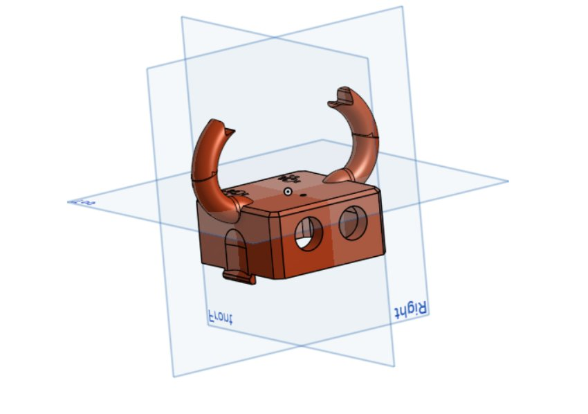
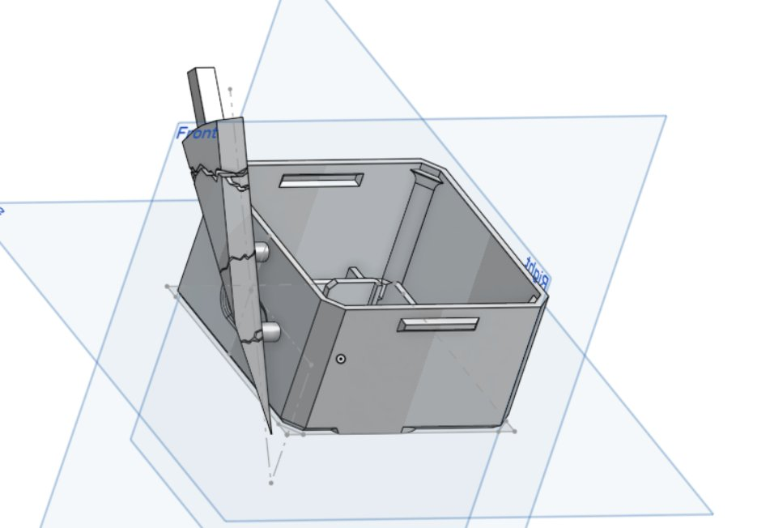
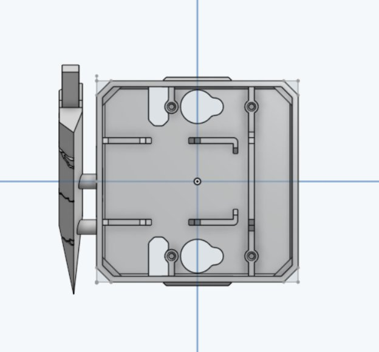
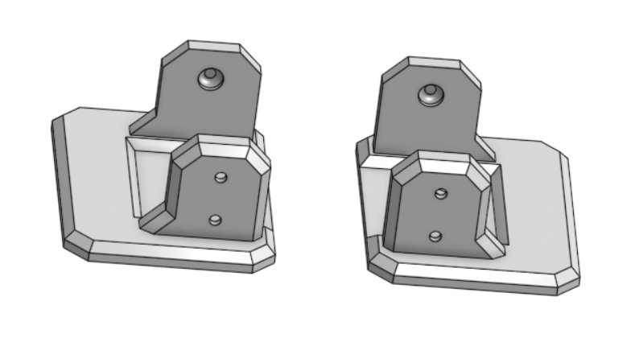
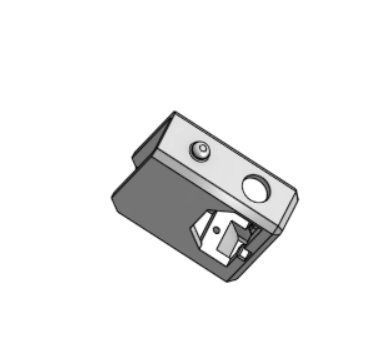
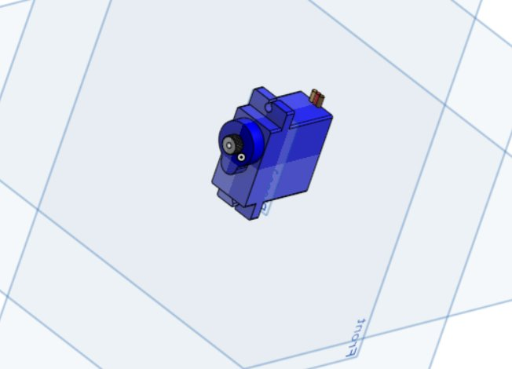
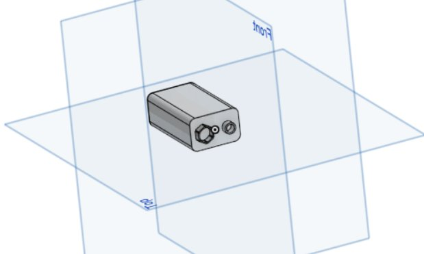
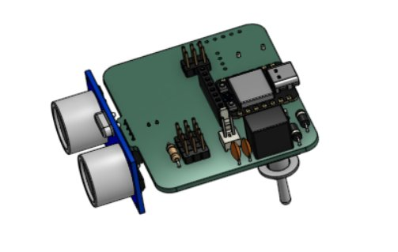

# Conception et prototypage

## Modélisation 3D

Nous avons travaillé sur **Onshape** à partir des fichiers de base Otto-MKS pour modifier et personnaliser les pièces de notre robot. La modification principale est la **tête personnalisée** avec deux cornes caractéristiques.

[Voir notre modèle Onshape](https://cad.onshape.com/documents/dc2aca01fe742e8085016c10/w/add9737cc5fec3410f20bf62/e/b48b7d90dc361639b8b7c192){: .btn .btn-primary }

### Pièces conçues

#### Tête


Tête personnalisée avec deux cornes, logement pour le capteur ultrason HC-SR04 (les deux trous circulaires à l'avant).

#### Corps — vue intérieure


Le corps accueille la carte électronique ESP32 et la batterie. Les ouvertures latérales permettent le passage des câbles et la fixation des servomoteurs de hanches.

#### Corps — vue du dessus


Vue du dessus montrant les emplacements de fixation de la carte et les passages de câbles.

#### Hanches


Les deux hanches (gauche et droite) relient le corps aux pieds via les servomoteurs. Elles sont symétriques.

#### Pied


Pied avec logement pour le servomoteur et platine d'appui au sol.

---

## Composants électroniques

#### Servomoteur


4 servomoteurs au total : 2 pour les hanches, 2 pour les pieds. Ils génèrent les oscillations nécessaires à la marche bipède.

#### Batterie


Batterie 9V rechargeable via USB-C, logée dans le corps du robot.

#### Carte Otto-MKS (ESP32)


Carte sur mesure intégrant un ESP32, un emplacement pour le capteur ultrason HC-SR04 (en bleu sur les côtés), un buzzer et les connecteurs servomoteurs.

---

## Impression 3D

Les pièces ont été imprimées au MakerSpace d'UniLaSalle Amiens en **PLA**.

{: .note }
> Section à compléter avec les photos d'impression et les paramètres retenus.

## Assemblage

L'assemblage suit les étapes des tutoriels Otto-MKS :
1. Fixation des servomoteurs dans les hanches et les pieds
2. Montage de la carte électronique dans le corps
3. Câblage des servomoteurs et du capteur ultrason
4. Installation de la batterie 9V USB-C
5. Fermeture du corps et fixation de la tête

{: .note }
> Section à compléter avec les photos d'assemblage.

## Programmation

Le code est développé avec l'**IDE Arduino** en C++ pour l'ESP32. Il gère :
- Les mouvements de marche avant/arrière
- La marche en crabe (déplacement latéral)
- Les virages gauche/droite
- 6 profils de vitesse (A à G)
- Un mode danse avec 6 mouvements aléatoires
- Une mélodie jouée sur le buzzer (non-bloquante)
- Le contrôle à distance via **RemoteXY** (Bluetooth BLE)

Le code source complet est disponible dans le repo : `project/Otto_Groupe04/Otto_Groupe04.ino`

```cpp
/*    -- HK --   */

// ================== REMOTEXY ==================
#define REMOTEXY_MODE__ESP32CORE_BLE
#include <BLEDevice.h>
#include <ESP32Servo.h>

#define REMOTEXY_BLUETOOTH_NAME "HK"
#define REMOTEXY_ACCESS_PASSWORD "silksong"

#include <RemoteXY.h>

#pragma pack(push, 1)
uint8_t const PROGMEM RemoteXY_CONF_PROGMEM[] =
  { 255,5,0,0,0,50,0,19,0,0,0,72,75,0,200,1,106,200,1,1,
  4,0,5,15,43,80,80,32,21,172,31,3,6,6,53,8,135,21,26,1,
  6,133,32,32,0,21,31,0,1,70,134,33,33,0,21,31,0 };

struct {
  int8_t  joystick_01_x;
  int8_t  joystick_01_y;
  uint8_t selectorSwitch_01; // 0=A 1=B 2=C 3=D 4=E 5=F 6=G(dance+musique)
  uint8_t button_01;         // virage gauche
  uint8_t button_02;         // virage droit
  uint8_t connect_flag;
} RemoteXY;
#pragma pack(pop)

// ================== VITESSE ==================
struct SpeedProfile { int stepDelay; int pauseDelay; };

SpeedProfile getSpeed() {
  switch (RemoteXY.selectorSwitch_01) {
    case 0: return {20, 120};
    case 1: return {16,  95};
    case 2: return {12,  70};
    case 3: return { 9,  50};
    case 4: return { 5,  20};
    case 5: return { 5,  10};
    case 6: return { 9,  50};
    default: return {10,  60};
  }
}

// ================== LOOP ==================
void loop() {
  RemoteXY_Handler();
  updateMusic();

  if (danceRunning()) {
    if (!musicOn) musicStart();
    playDance();
    if (!danceRunning()) musicStop();
    return;
  } else {
    if (musicOn) musicStop();
  }

  if (RemoteXY.joystick_01_y > 30 && abs(RemoteXY.joystick_01_x) <= 30) {
    if (RemoteXY.button_02)       virageGauche();
    else if (RemoteXY.button_01)  virageDroit();
    else { pasDroit(40,40,25); pasGauche(40,40,25); }
  }
  else if (RemoteXY.joystick_01_y < -30 && abs(RemoteXY.joystick_01_x) <= 30) {
    pasArriereDroit(40,25); pasArriereGauche(40,25);
  }
  else if (RemoteXY.joystick_01_x < -30 && abs(RemoteXY.joystick_01_y) <= 30) {
    crabeGauche();
  }
  else if (RemoteXY.joystick_01_x > 30 && abs(RemoteXY.joystick_01_y) <= 30) {
    crabeDroit();
  }
  else {
    initialisation();
  }
}
```

[Code complet sur GitHub](https://github.com/Makerspace-Amiens-2025-26/Otto-Groupe04/blob/main/project/Otto_Groupe04/Otto_Groupe04.ino){: .btn }
